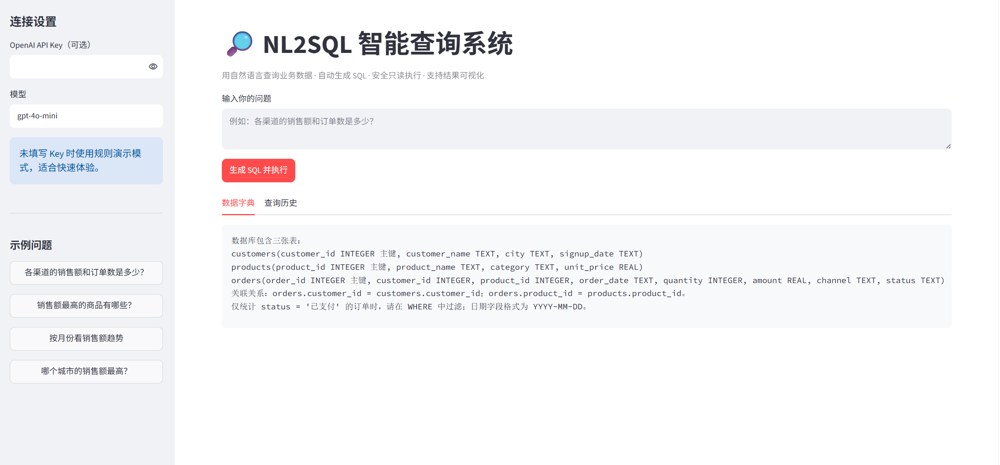

# NL2SQL 智能查询系统

> 基于大语言模型的自然语言数据查询工具：输入业务问题，自动生成并安全执行 SQL。



## 会议活动运营 Agent

同一项目内附带 `meeting_agent.py`，可独立启动：

```bash
streamlit run meeting_agent.py
```

它能根据活动资料生成活动卡片、嘉宾邀约文案和分节点提醒，并根据会后纪要生成总结、亮点、待办和关键指标，支持 Markdown 导出。

一个面向业务运营场景的自然语言查询 MVP。用户可以用中文提问，系统通过大语言模型生成 SQLite SQL，经过只读安全校验后执行，并展示结果表格、柱状图和 CSV 下载。

## 快速启动

```bash
cd work/nl2sql_app
pip install -r requirements.txt
streamlit run app.py
```

不配置 API Key 也能运行规则演示模式。若要接入模型，可设置 `DEEPSEEK_API_KEY`，或在侧边栏临时输入 Key。默认使用 DeepSeek OpenAI 兼容接口 `https://api.deepseek.com` 和你指定的模型 ID `deepseek-v4-pro`；如果接口提示模型不存在，请改成服务商控制台显示的准确名称。

## 作品集亮点

- Schema 注入：将数据字典和关联关系提供给模型，降低幻觉字段风险。
- SQL 安全层：只允许单条 SELECT/WITH，拦截写入、DDL、PRAGMA 等危险操作，并以 SQLite 只读连接执行。
- 可解释交互：同时展示数据结果、生成 SQL、数据来源和查询历史。
- 可扩展：替换 `schema_text()` 和 `run_query()` 即可接入真实业务数据库。

## 演示问题

- 各渠道的销售额和订单数是多少？
- 销售额最高的商品有哪些？
- 按月份看销售额趋势
- 哪个城市的销售额最高？

演示数据库为合成数据，数据库文件会在首次启动时自动生成。
