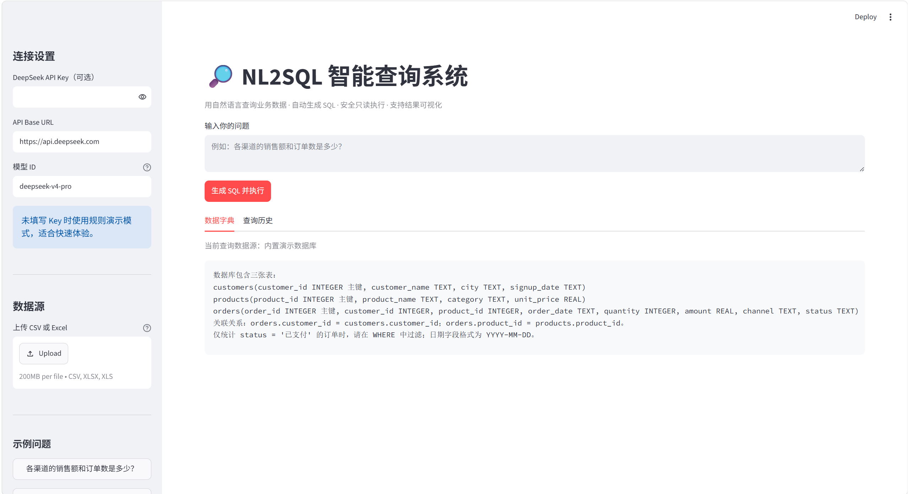
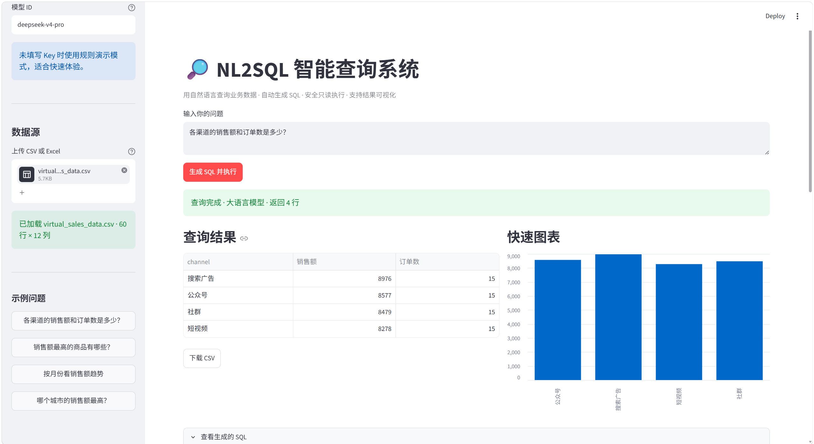

# NL2SQL 智能查询系统

> 面向运营和业务人员的 AI 数据分析工具：上传自己的 CSV/Excel，用自然语言提问，自动生成 SQL、图表和业务结论。

## 界面预览

上传数据前的查询界面：



上传数据后，系统根据文件字段生成问题建议、SQL、结果表格和图表：



## 核心能力

- **自有数据接入**：上传 CSV/Excel，自动识别字段和类型，兼容中文列名。
- **自然语言查询**：将业务问题转换为 SQLite SQL，支持 DeepSeek 等 OpenAI 兼容接口。
- **AI 结果解读**：查询完成后自动提炼关键数字和业务结论，可在侧边栏关闭以保持数据本地处理。
- **自动修复**：SQL 执行失败时，将错误信息反馈给模型并自动重试一次。
- **智能推荐问题**：根据上传文件的日期、金额、渠道、商品、城市等字段生成可点击问题。
- **安全执行**：只允许单条 `SELECT/WITH`，拦截写入、DDL、系统表和危险关键字。
- **本地降级**：未配置 API Key 时使用字段感知的本地规则模式，数据不离开本机。

## AI 工作流

```text
上传 CSV/Excel
    → 字段识别与安全列名映射
    → Schema 注入 Prompt
    → 生成只读 SQL
    → 安全校验与 SQLite 执行
    → 失败时自动修复并重试
    → 结果表格、图表与 AI 洞察
```

## 快速启动

```bash
git clone https://github.com/eyy0926/codex.git
cd codex
pip install -r requirements.txt
streamlit run app.py
```

启动后：

1. 左侧选择“一键示例数据”，或上传自己的 CSV/Excel；
2. 点击系统根据字段生成的推荐问题，或手动输入问题；
3. 点击“生成 SQL 并执行”；
4. 查看 SQL、查询结果、图表和“数据洞察”，必要时下载 CSV。

## 模型配置

不配置 API Key 也能运行本地规则模式。接入 DeepSeek 时，可以在侧边栏输入 Key，或复制配置模板：

```bash
copy .streamlit\secrets.toml.example .streamlit\secrets.toml
```

然后编辑 `.streamlit/secrets.toml`：

```toml
DEEPSEEK_API_KEY = "your-api-key"
DEEPSEEK_BASE_URL = "https://api.deepseek.com"
DEEPSEEK_MODEL = "deepseek-v4-pro"
```

模型 ID 以你的服务商控制台为准。不要把真实 Key 提交到 GitHub。

## 隐私和限制

- 上传文件只在当前会话中处理，不写入项目目录。
- 生成 SQL 时默认只向模型发送字段名、原始列名和数据类型，不发送原始数据行；可选开启前三行样例。
- 开启“使用模型生成业务洞察”后，查询结果最多前 20 行会发送给模型；关闭后使用本地规则摘要。
- 单个文件最大 20 MB，最多 100,000 行；查询最多返回 200 行，超过时会提示截断。
- 生产环境建议使用数据库只读账号，并在部署平台配置 Secrets。

## 项目结构

```text
app.py                         Streamlit 页面与交互
nl2sql_core.py                 数据接入、Prompt、SQL 安全、执行和洞察核心
tests/test_core.py             核心逻辑自动化测试
.streamlit/config.toml         上传大小与 Streamlit 配置
assets/                        项目截图
```

## 自动化测试

```bash
python -m unittest discover -s tests -v
```

当前测试覆盖数据一致性、CSV 读取、中文/重复列名映射、Schema 脱敏、危险 SQL 拦截、结果行数限制、规则查询和推荐问题生成。

## 部署

可以直接将仓库连接到 Streamlit Community Cloud，入口文件选择 `app.py`，并在部署平台的 Secrets 中配置 `DEEPSEEK_API_KEY`、`DEEPSEEK_BASE_URL` 和 `DEEPSEEK_MODEL`。项目也提供了 `Dockerfile`，可部署到任意支持 Docker 的平台：

```bash
docker build -t nl2sql .
docker run -p 8501:8501 nl2sql
```

## 演示问题

- 各渠道的销售额分别是多少？
- 哪个商品销售额最高？
- 按月份查看销售额趋势。
- 哪个城市的销售额最高？
- 退款订单有多少笔，退款金额是多少？

内置示例数据为合成销售数据，适合演示，不代表真实业务结果。
